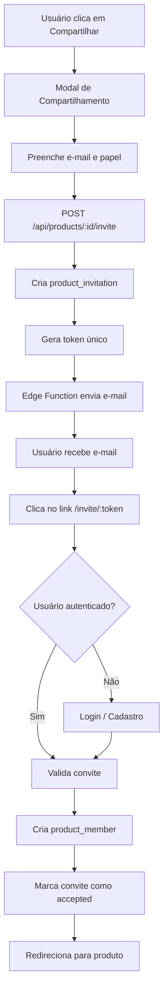

# Fluxo de Compartilhamento de Produto no Pachai

## Visão Geral

O sistema de compartilhamento permite que owners e editors compartilhem produtos com outras pessoas via convites por e-mail. O compartilhamento dá acesso apenas ao **Contexto Cognitivo do Produto** e aos **Vereditos**. **Conversas permanecem privadas e nunca são compartilhadas**.

## Arquitetura do Fluxo



## Estrutura de Dados

### Tabela `product_invitations`

- `id` (uuid, pk)
- `product_id` (uuid, fk → products)
- `email` (text)
- `role` (enum: 'editor' | 'viewer')
- `token` (uuid, unique)
- `invited_by` (uuid, fk → auth.users)
- `status` (enum: 'pending' | 'accepted' | 'expired')
- `created_at` (timestamptz)
- `expires_at` (timestamptz, padrão: 7 dias)

### Regras

- Token único e não previsível (UUID v4)
- Convites expiram após 7 dias
- Convites não são deletados, apenas expiram
- DELETE é proibido via RLS

## Regras de Permissão

### Papéis

1. **Owner**
   - Controle total do produto
   - Pode compartilhar, editar contexto, criar vereditos
   - Pode ver e criar conversas

2. **Editor**
   - Pode criar conversas
   - Pode editar contexto
   - Pode criar vereditos
   - Pode compartilhar produtos

3. **Viewer**
   - Pode visualizar contexto e vereditos
   - **NÃO pode editar**
   - **NÃO vê conversas privadas**

### RLS Policies

#### `product_invitations`
- **SELECT:** Owner e Editor podem ver convites
- **INSERT:** Owner e Editor podem criar convites
- **UPDATE:** Apenas Owner pode atualizar (sistema pode marcar como accepted/expired)
- **DELETE:** ❌ PROIBIDO

#### `conversations`
- **SELECT:** Apenas Owner e Editor podem ver conversas
- **INSERT:** Apenas Owner e Editor podem criar conversas
- **UPDATE:** Apenas Owner e Editor podem atualizar conversas

#### `messages`
- **SELECT:** Apenas Owner e Editor podem ver mensagens
- **INSERT:** Apenas Owner e Editor podem criar mensagens

## Fluxo de Aceitação de Convites

1. **Validação do Token**
   - Buscar convite pelo token
   - Verificar se existe e está pendente
   - Verificar expiração

2. **Autenticação**
   - Se não autenticado: armazenar token e redirecionar para login
   - Após login: processar convite automaticamente

3. **Validação de E-mail**
   - E-mail do usuário deve corresponder ao convite
   - Se não corresponder, mostrar mensagem de erro

4. **Criação de Membro**
   - Verificar se já é membro (evitar duplicação)
   - Criar registro em `product_members`
   - Atualizar convite para status 'accepted'
   - Redirecionar para `/products/{productId}`

## E-mail de Convite

### Assunto
"Convite para colaborar em um produto no Pachai"

### Corpo (texto simples)
```
Você foi convidado(a) para colaborar em um produto no Pachai.

Produto: {{product_name}}
Papel: {{role}}

O Pachai é um espaço de pensamento contínuo para amadurecer decisões de produto.

Ao aceitar o convite, você terá acesso ao contexto cognitivo e aos vereditos desse produto.
Conversas privadas não são compartilhadas.

[ Aceitar convite ]
{{invite_url}}
```

### Características
- Texto simples, sem linguagem comercial
- Link direto para aceitar convite
- Mensagem pessoal opcional incluída se fornecida

## Endpoints da API

### POST `/api/products/[id]/invite`

Cria um novo convite para compartilhar o produto.

**Validações:**
- Usuário autenticado
- Usuário é owner ou editor do produto
- Produto existe
- E-mail válido
- Papel válido ('editor' ou 'viewer')
- E-mail não é do próprio usuário

**Body:**
```json
{
  "email": "user@example.com",
  "role": "editor",
  "message": "Mensagem opcional"
}
```

**Resposta:**
```json
{
  "success": true,
  "invitation": {
    "id": "uuid",
    "email": "user@example.com",
    "role": "editor",
    "expires_at": "2024-01-08T12:00:00Z"
  }
}
```

## Edge Function

### `send-invite-email`

**Localização:** `supabase/functions/send-invite-email/index.ts`

**Responsabilidades:**
- Validar convite
- Verificar expiração
- Enviar e-mail via Resend (ou outro serviço)
- Tratar erros sem falhar a criação do convite

**Variáveis de Ambiente:**
- `RESEND_API_KEY`
- `NEXT_PUBLIC_SITE_URL`
- `SUPABASE_URL`
- `SUPABASE_SERVICE_ROLE_KEY`

## Considerações de Segurança

1. **Token único e não previsível** (UUID v4)
2. **Validação de expiração obrigatória**
3. **Token só pode ser usado uma vez**
4. **Validação de e-mail do usuário** ao aceitar convite
5. **RLS protege todas as operações**
6. **Verificação de permissões** em todas as APIs
7. **Viewers não acessam conversas** (RLS + UI)

## Experiência do Usuário

### Para Viewers

- Veem apenas contexto cognitivo e vereditos
- Não veem conversas na sidebar
- Não veem lista de conversas na página do produto
- Mensagem explicativa sobre acesso limitado

### Para Owners e Editors

- Acesso completo ao produto
- Podem criar e ver conversas
- Podem compartilhar produtos
- Podem editar contexto e criar vereditos

## Critérios de Sucesso

- ✅ Compartilhamento simples e claro
- ✅ Nenhuma conversa privada vazada
- ✅ Convite por e-mail funcional
- ✅ Onboarding automático e limpo
- ✅ Papéis respeitados (owner, editor, viewer)
- ✅ Produto continua coerente com o DNA do Pachai

## Regra Final

**Produto sempre vence conversa.**  
**Governança sempre vence conveniência.**

## Migrations

1. `014_add_product_invitations.sql` - Cria tabela de convites
2. `015_update_conversations_rls_for_members.sql` - Atualiza RLS para considerar product_members

## Arquivos Implementados

- `supabase/migrations/014_add_product_invitations.sql`
- `supabase/migrations/015_update_conversations_rls_for_members.sql`
- `app/lib/types/database.ts` (atualizado)
- `app/lib/pachai/roles.ts` (atualizado)
- `app/api/products/[id]/invite/route.ts`
- `supabase/functions/send-invite-email/index.ts`
- `app/components/product/ShareProductModal.tsx`
- `app/(dashboard)/products/[productId]/conversations/[conversationId]/page.tsx` (atualizado)
- `app/invite/[token]/page.tsx`
- `middleware.ts` (atualizado)
- `app/(auth)/login/page.tsx` (atualizado)
- `app/components/sidebar/ProductsSidebar.tsx` (atualizado)
- `app/(dashboard)/products/[productId]/page.tsx` (atualizado)
- `app/contexts/ProductsContext.tsx` (atualizado)
